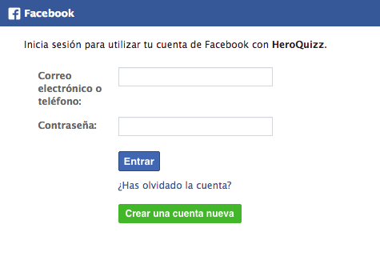

# Facebook-Hack
HTML application designed to help to teach my classmates about phishing attacks. It imitates the Facebook login inside a game that was popular at that time, and collects the information of the account. The whole directory and its contents need to be served as static files.

